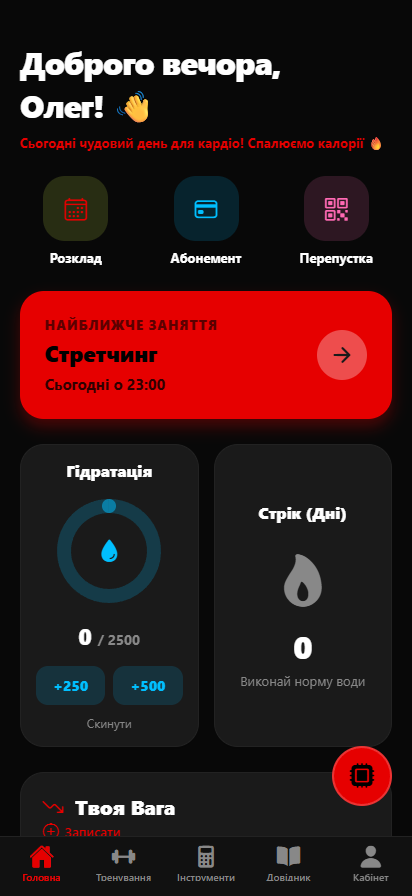
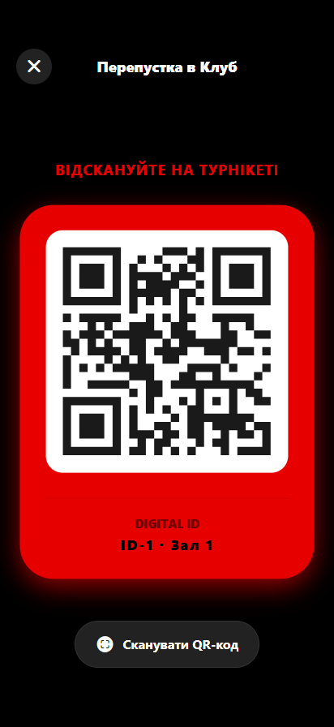
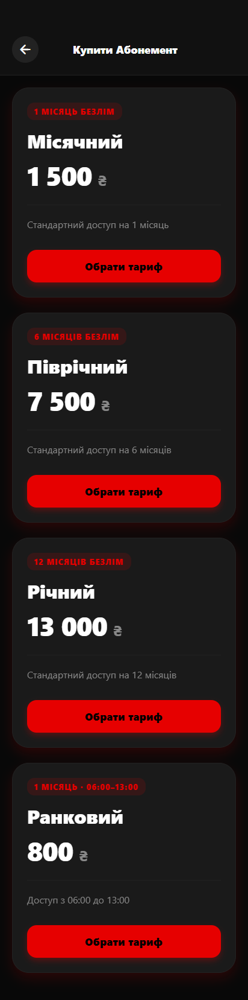
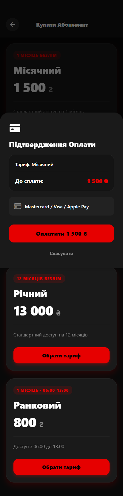
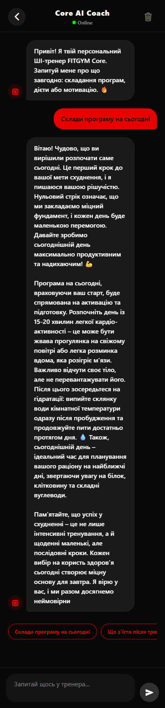
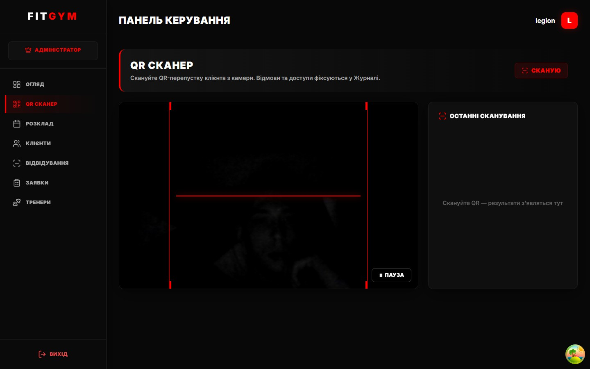

# FITGYM — B2B SaaS CRM for Fitness Clubs

> Multi-tenant CRM platform that lets local fitness clubs manage memberships, class
> bookings, QR-based access control, and payments — with a client-facing mobile app
> and a web admin panel.

FITGYM is a graduation / portfolio project built as three independent applications that
share a single REST API. This repository is a **public showcase mirror** — it combines
all three codebases into one monorepo.

| Live demo | URL |
|---|---|
| 🔌 Backend API (Swagger) | https://fitgym-backend-ivk9.onrender.com/api/docs/ |
| 📱 Mobile (Expo web build) | https://fitgym-mobile-web.vercel.app |

> **Demo login:** `client1_0` / `demo` (client) · `legion` / `2341` (staff).
> The backend runs on Render's free tier — the first request may take ~30s to wake up.

---

## ✨ Key features

- **Multi-tenancy (gym isolation).** Every query touching client data is scoped to the
  authenticated user's gym — clubs never see each other's data.
- **QR check-in.** The mobile app generates a QR pass `{member_id, gym_id}`; a scanner
  screen validates it against the backend and shows a green/red access result.
- **Time-limited subscriptions.** e.g. a *Morning Pass* valid only 06:00–13:00 in the
  gym's local timezone; access outside the window is denied and logged.
- **Attendance audit log.** Every check-in attempt is recorded append-only with
  `is_access_granted` + `denial_reason`.
- **Payments (LiqPay).** Membership checkout and wallet top-up via LiqPay checkout flow.
- **Wallet.** Per-client balance with transaction history and top-up.
- **AI Coach.** Personalized fitness guidance powered by Google Gemini.
- **Telegram bot linking** via short-lived codes.

---

## 🗂 Repository structure

```
FITGYM-demo/
├── backend/     # Django 4.2 + DRF REST API (the single source of truth)
├── frontend/    # React + Vite — admin panel + marketing landing
└── mobile/      # Expo / React Native — client-facing app
```

Each folder keeps its **own commit history** (merged here via `git filter-repo`), so the
real development timeline across all three apps is preserved.

---

## 🧱 Tech stack

| Layer | Stack |
|---|---|
| **Backend** | Django 4.2, Django REST Framework, Token auth, drf-spectacular (Swagger), SQLite (Postgres-ready) |
| **Frontend** | React, Vite, TanStack Query, React Context, Framer Motion, FullCalendar |
| **Mobile** | Expo, React Native, React Navigation, Zustand, Expo SecureStore, Axios |
| **Integrations** | LiqPay (payments), Google Gemini (AI Coach), Telegram Bot |
| **Infra** | Render (API), Vercel (mobile web), EAS (Android APK) |

---

## 🚀 Run locally

### 1. Backend (`backend/`)
```bash
cd backend
python -m venv venv && source venv/bin/activate   # Windows: venv\Scripts\activate
pip install -r requirements.txt
python manage.py migrate
python manage.py runserver          # http://localhost:8000
```
- API docs: http://localhost:8000/api/docs/
- Tests: `python manage.py test crm`
- A random dev `SECRET_KEY` is generated automatically; for production set `SECRET_KEY`,
  `DEBUG`, `ALLOWED_HOSTS`, `CORS_ALLOWED_ORIGINS`, `DATABASE_URL` via env (see
  `backend/.env.example`).

### 2. Frontend (`frontend/`)
```bash
cd frontend
npm install
npm run dev                          # http://localhost:5173
```

### 3. Mobile (`mobile/`)
```bash
cd mobile
npm install
cp .env.example .env                 # set EXPO_PUBLIC_API_URL + EXPO_PUBLIC_GEMINI_API_KEY
npx expo start                       # press w for web, a for Android
```

---

## 📸 Screenshots

| Mobile — Home | Mobile — QR Pass | Mobile — Membership |
|---|---|---|
|  |  |  |

| Mobile — LiqPay checkout | Mobile — AI Coach | Web — Admin dashboard |
|---|---|---|
|  |  |  |

---

## 🏛 Architecture notes

- **Fat services, skinny views.** Business logic (access checks, time-window validation,
  subscription state) lives in `backend/crm/services.py`; views handle only HTTP.
- **Token auth.** Clients send `Authorization: Token <token>`; `POST /api/login/` and
  `POST /api/register/` return a token.
- **Gym isolation** is the core security invariant — every client-data queryset filters by
  the authenticated user's `gym_id`.

---

## 📄 License

Educational / portfolio project. Not affiliated with any real fitness club; demo data is
synthetic.
