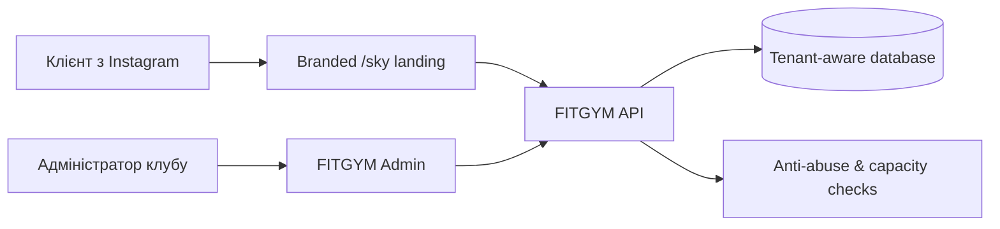

# FITGYM

> **Gym operations platform · Public booking · Staff workflow**

**Публічна вітрина приватного продукту. Вихідний код FITGYM у цьому
репозиторії не публікується.**

FITGYM допомагає фітнес-клубу перевести шлях від розкладу до підтвердженого
запису в один керований процес. Поточний showcase показує MVP, підготовлений
для пілоту з **Berdychiv Sky**.

## Що показує demo

### Клієнт: запис без акаунта

Клієнт переходить із посилання в Instagram, бачить актуальні заняття,
обирає потрібне, залишає ім’я й телефон та отримує чесне повідомлення про
прийняту заявку.

- mobile-first branded сторінка;
- rolling-розклад на найближчі 14 днів;
- час, тренер, формат і доступні місця;
- проста форма без реєстрації та пароля;
- окремі success, full, duplicate, empty й offline/error states.

▶️ [Переглянути 19-секундне відео клієнтського сценарію](assets/sky-public-booking-demo.mp4)

### Адміністратор: заявки під контролем

Нові записи потрапляють в окрему admin-вкладку. Адміністратор бачить клієнта,
заняття, тренера, місткість і залишок місць, після чого підтверджує або відхиляє
заявку.

- red badge для нових записів;
- статуси, періоди та пошук за ім’ям або телефоном;
- desktop table і responsive cards;
- confirm/reject із повторною серверною перевіркою capacity;
- захист від подвійної дії та зрозумілі race/error states.

▶️ [Переглянути 36-секундне відео admin workflow](assets/sky-admin-booking-records-demo.mp4)

## Як побудований потік

```mermaid
flowchart LR
    Client["Клієнт з Instagram"] --> Sky["Branded /sky landing"]
    Sky --> API["FITGYM API"]
    Staff["Адміністратор клубу"] --> Admin["FITGYM Admin"]
    Admin --> API
    API --> DB[("Tenant-aware database")]
    API --> Guard["Anti-abuse & capacity checks"]
```

Продукт має спільне tenant-aware ядро, а брендовані сторінки та правила клубу
підключаються як окремий tenant layer — без копіювання backend чи бази даних.

## Security by design

- tenant, role та ownership перевіряються сервером;
- pending-заявка не резервує місце;
- confirm повторно перевіряє capacity у транзакції;
- phone normalization, consent, honeypot і rate limits;
- Turnstile-перевірка для публічного booking flow;
- staff-функції недоступні звичайному клієнту або тренеру без відповідної ролі.

## Статус

| Частина | Стан |
|---|---|
| Sky guest booking flow | Реалізовано та перевірено локально |
| Admin records workflow | Реалізовано та перевірено локально |
| Responsive QA | 390 / 1024 / 1440 px |
| Public pilot | Pre-launch, контрольований production smoke ще попереду |
| Product source code | Private |

Live URL навмисно не публікується, доки production launch gate не пройде
повністю. Showcase не видає локально готову функцію за вже запущений сервіс.

## Про цей репозиторій

Тут зберігаються лише:

- актуальний опис продукту;
- синтетичні screenshots;
- короткі demo-відео;
- безпечна high-level схема.

Тут **немає** source code, credentials, `.env`, seed data, production
конфігурації, внутрішньої документації або реальних даних клієнтів.

Усі імена, телефони, заняття та інші записи в demo-матеріалах синтетичні.

---

© 2026 [xand0dev](https://github.com/xand0dev). All rights reserved.

This repository is a product showcase, not an open-source distribution.
