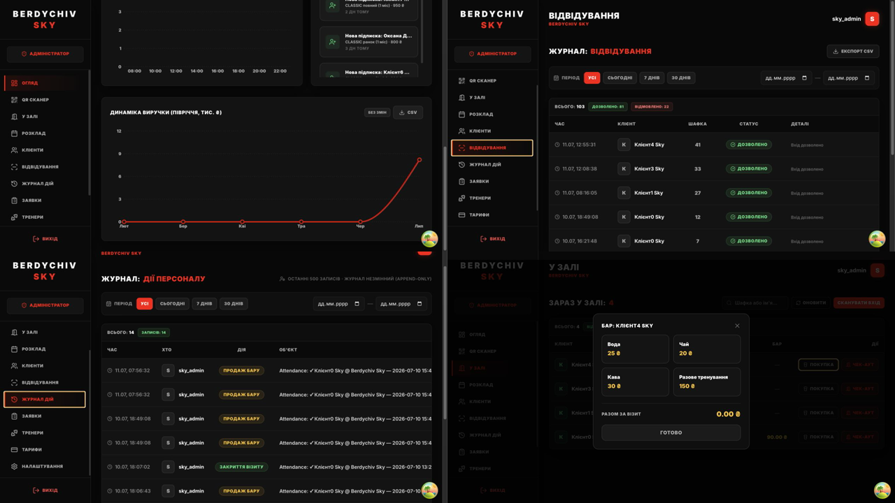
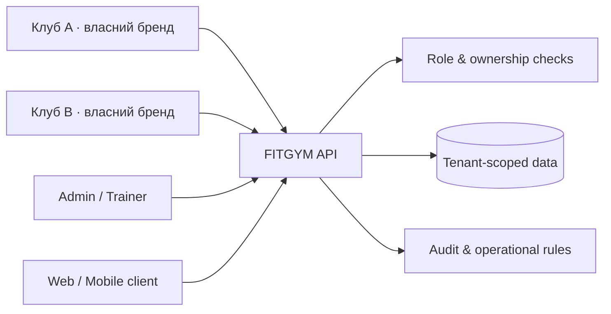
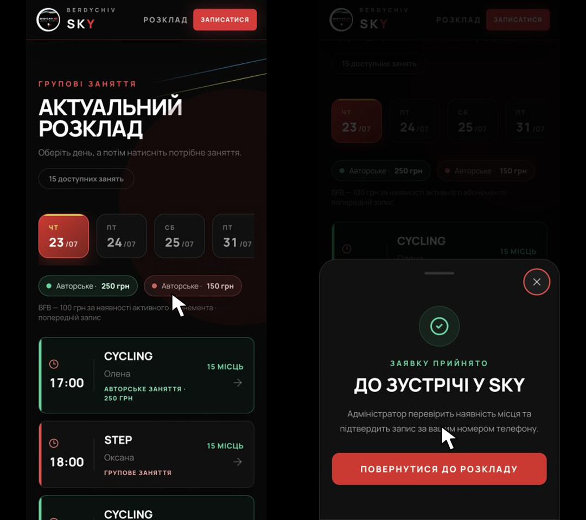
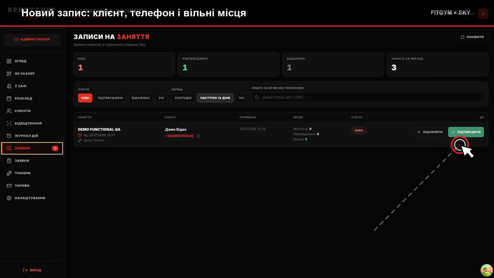

# FITGYM — multi-tenant CRM for fitness clubs

> **Клієнти · Абонементи · Розклад · Записи · Відвідування · Операції клубу**

**Публічна вітрина приватного продукту. Вихідний код FITGYM у цьому
репозиторії не публікується.**

FITGYM — це CRM-платформа, у якій кожен фітнес-клуб працює у власному
ізольованому tenant-просторі зі своїми клієнтами, персоналом, розкладом,
абонементами та правилами доступу.

## Що це за продукт

FITGYM об’єднує щоденну роботу клубу в одному контурі:

- **клуби й ролі** — окремі tenant-простори для власника, адміністратора,
  тренера та клієнта;
- **клієнтська база** — профілі, заявки, абонементи та історія взаємодії;
- **розклад і записи** — заняття, тренери, зали, capacity та бронювання;
- **контроль доступу** — QR-pass, check-in і журнал дозволених/відхилених
  відвідувань;
- **робота адміністратора** — продажі, операції в залі, експорт і audit log;
- **клієнтський застосунок** — абонемент, записи, QR-перепустка й особистий
  кабінет;
- **брендовані surfaces** — окремий вигляд і сценарії клубу поверх спільного
  захищеного ядра.

## Multi-tenant архітектура

```mermaid
flowchart LR
    GymA["Клуб A · власний бренд"] --> Core["FITGYM API"]
    GymB["Клуб B · власний бренд"] --> Core
    Staff["Admin / Trainer"] --> Core
    Client["Web / Mobile client"] --> Core
    Core --> Roles["Role & ownership checks"]
    Core --> Data[("Tenant-scoped data")]
    Core --> Audit["Audit & operational rules"]
```

Один backend не означає спільний доступ до даних. Tenant, роль і ownership
перевіряються сервером, а бренд і дозволені сценарії підключаються як
конфігурація конкретного клубу — без копіювання продукту чи бази даних.

## CRM-модулі

| Контур | Що контролює |
|---|---|
| Клієнти | Профілі, статуси, контакти й історія |
| Абонементи | Тарифи, строки дії, часові обмеження та заявки |
| Розклад | Заняття, тренери, зали, місця й бронювання |
| Відвідування | QR-перевірка, check-in та причини відмови |
| Операції в залі | Поточні відвідувачі, додаткові покупки й завершення візиту |
| Контроль | Dashboard, CSV export і незмінний журнал дій |
| Client experience | Mobile/web кабінет, записи та QR-pass |

## Case study: Berdychiv Sky

Sky — не окремий продукт і не межа FITGYM. Це поточний пілотний кейс, у якому
до CRM додано короткий acquisition flow:

**Instagram bio → branded `/sky` → актуальний розклад → заявка на заняття →
confirm/reject у CRM.**

### Клієнт: запис без акаунта

Клієнт бачить rolling-розклад на найближчі 14 днів, обирає заняття, залишає
ім’я й телефон та отримує чесне повідомлення про прийняту заявку.

▶️ [Переглянути 19-секундне відео клієнтського сценарію](assets/sky-public-booking-demo.mp4)

### Адміністратор: заявка стає керованим CRM-записом

Нові записи потрапляють в окрему admin-вкладку зі статусами, пошуком,
capacity, confirm/reject і повторною серверною перевіркою вільних місць.

▶️ [Переглянути 36-секундне відео admin workflow](assets/sky-admin-booking-records-demo.mp4)

## Security by design

- tenant, role та ownership перевіряються сервером;
- booking і capacity rules виконуються в backend, а не лише в UI;
- phone normalization, consent, honeypot і rate limits для public flow;
- Turnstile-перевірка для гостьових заявок;
- staff-функції доступні лише відповідним ролям;
- operational actions залишають audit trail.

## Поточний статус showcase

| Частина | Стан |
|---|---|
| Multi-tenant CRM core | Існуюче приватне product codebase |
| Admin і client workflows | Реалізовані, проходять окремі release gates |
| Sky acquisition case | Поточний MVP, локальний QA green |
| Public pilot | Pre-launch, контрольований production smoke ще попереду |
| Product source code | Private |

Live URL навмисно не публікується, доки production launch gate не пройде
повністю. Showcase не видає локально готову функцію за вже запущений сервіс.

## Про цей репозиторій

Тут зберігаються лише актуальний опис продукту, synthetic screenshots,
короткі demo-відео та безпечна high-level схема.

Тут **немає** source code, credentials, `.env`, seed data, production
конфігурації, внутрішньої документації або реальних даних клієнтів.

Усі імена, телефони, заняття та інші записи в demo-матеріалах синтетичні.

---

© 2026 [xand0dev](https://github.com/xand0dev). All rights reserved.

This repository is a product showcase, not an open-source distribution.
